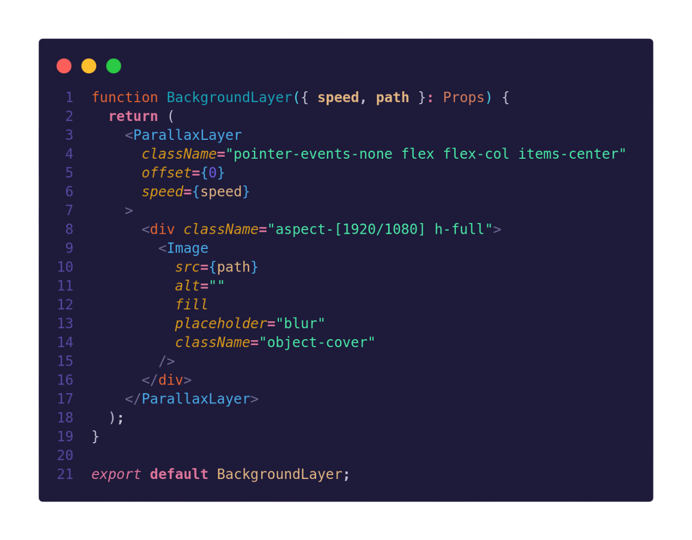
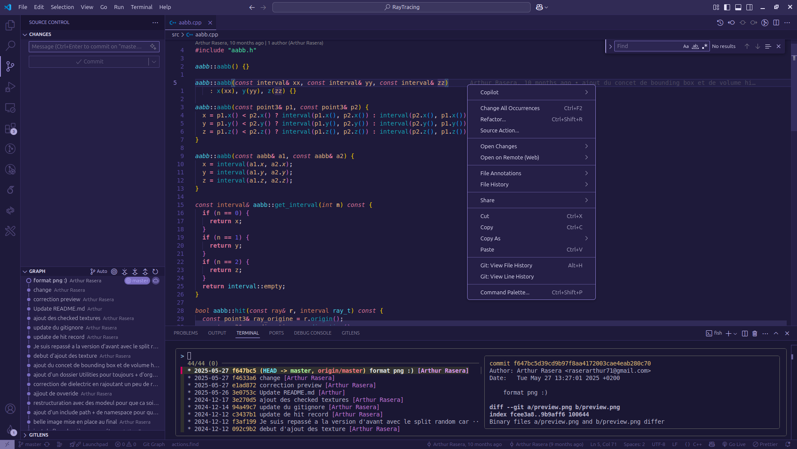

# OSMOZ THEME

`Osmoz` is a dual theme for Visual Studio Code — available in both **Dark** and **Light** variants — designed to be clean, efficient, and visually pleasing.

    

## Installation

1. Open the `Extensions` panel in VSCode.
2. Search for `Osmoz Theme`.
3. Click `Install`.
4. If the theme is not applied automatically, open the command palette with `Ctrl`+`Shift`+`P`,then type `Color Theme`, and select `Osmoz Dark` or `Osmoz Light`.

## Features

- Dark theme with high contrast and `minimalistic` design.
- Two variants:
  - 🌑 Osmoz Dark: elegant, high contrast, and minimalistic.
  - ☀️ Osmoz Light: clean, balanced, and comfortable for bright environments.
- Clear `syntax` highlighting for multiple languages.
- Easily distinguishable elements to improve `focus` and `readability`.

## Previews

### 🌑 Osmoz Dark

    

    

### ☀️ Osmoz Light

[Preview]

[Preview]

## Constant Improvements

We are continuously improving `Osmoz`!  
If you notice anything missing or any issue, feel free to create an **issue** here:
[Create a GitHub Issue](https://github.com/Raseraa0/osmoz-theme/issues).

## Links

- [GitHub Repository](https://github.com/Raseraa0/osmoz-theme)
- [VSCode Marketplace](https://marketplace.visualstudio.com/items?itemName=ArthurRasera.osmoz)
